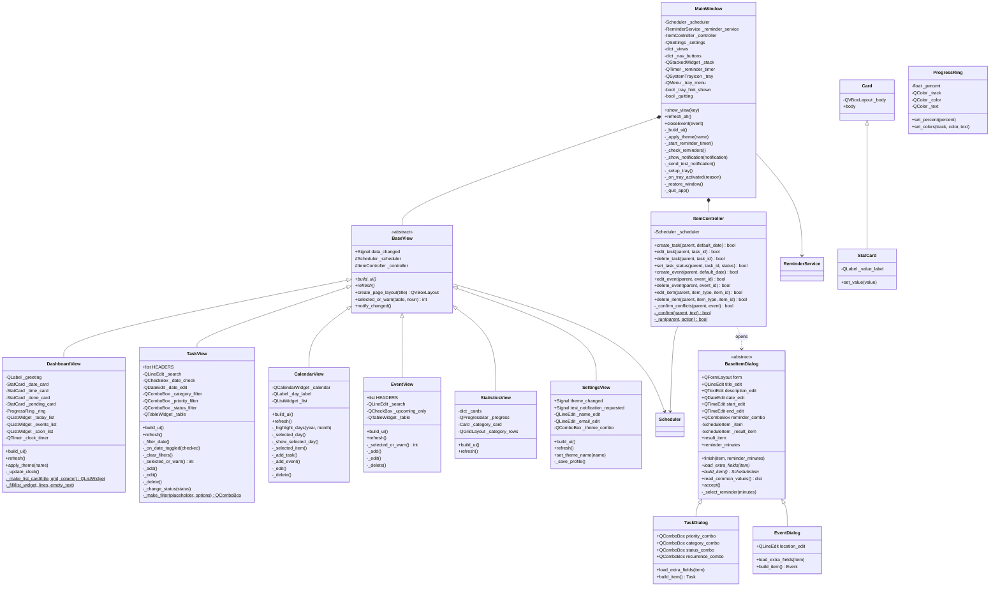
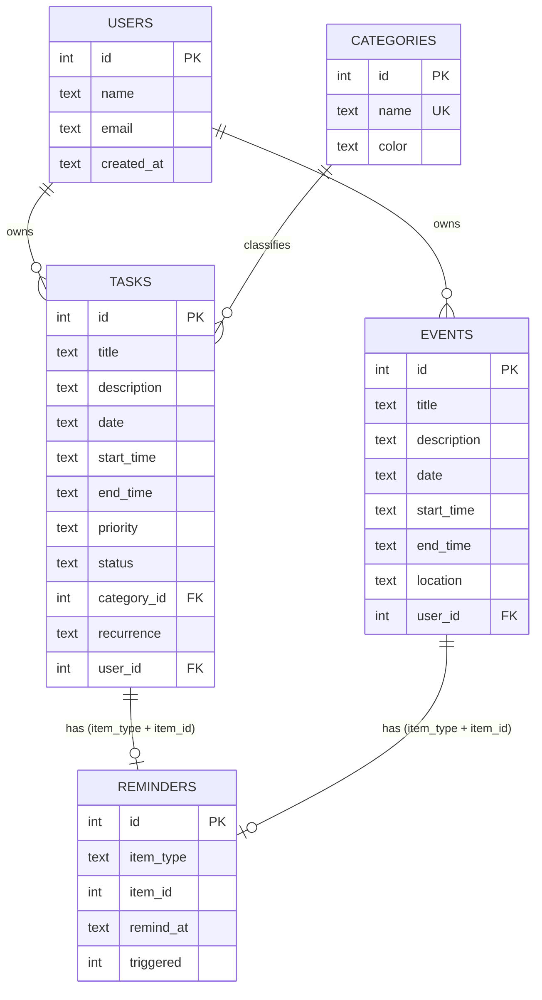

# Personal Scheduler

A local desktop application for managing tasks, events and reminders, built with **Python, PySide6 (Qt 6) and SQLite** using a layered, object-oriented design.


-41cd52)


---

## Table of Contents

1. [Overview](#1-overview)
2. [Technology Stack](#2-technology-stack)
3. [Project Structure](#3-project-structure)
4. [Getting Started](#4-getting-started)
5. [Architecture](#5-architecture)
6. [Domain Model](#6-domain-model)
7. [Database](#7-database)
8. [Users & Access](#8-users--access)
9. [Task Lifecycle](#9-task-lifecycle)
10. [Event Management](#10-event-management)
11. [Reminders & Notifications](#11-reminders--notifications)
12. [Calendar, Search & Filters](#12-calendar-search--filters)
13. [Dashboard & Statistics](#13-dashboard--statistics)
14. [Data Handling & Validation](#14-data-handling--validation)
15. [Business Rules Summary](#15-business-rules-summary)
16. [Design Decisions & Rationale](#16-design-decisions--rationale)
17. [Testing](#17-testing)
18. [Packaging](#18-packaging)
19. [Suggested Demo Walkthrough](#19-suggested-demo-walkthrough)
20. [Troubleshooting](#20-troubleshooting)
21. [Limitations & Possible Extensions](#21-limitations--possible-extensions)

---

## 1. Overview

**Personal Scheduler** is a local desktop application for managing tasks, events and reminders. It runs entirely on your machine: no server, no account, no browser. All data lives in a single SQLite file.

The project is also a worked example of object-oriented design: a layered architecture, an abstract base class with two subclasses, validated encapsulation, polymorphic screens, and dependency injection through constructors.

| Area | Capabilities |
|------|--------------|
| **Tasks** | Add, edit and delete (with confirmation); status *Pending / In Progress / Completed*; priority *Low / Medium / High*; categories |
| **Recurring tasks** | Daily, weekly or monthly; completing a task creates the next occurrence |
| **Events** | Date, start/end time and location; warning when events overlap |
| **Calendar** | Month view with highlighted days; select a day to see its tasks and events |
| **Dashboard** | Date, live clock, counters, today's tasks, upcoming events, tasks due soon |
| **Search & filters** | Search by title or description; filter by date, category, priority and status |
| **Reminders** | From "at start time" up to "1 day before", delivered as desktop notifications |
| **Statistics** | Totals, completion percentage, overdue count, tasks by category |
| **Personalization** | Light and dark themes; profile settings |


| Calendar | Calendar (dark) |
|:--:|:--:|
|  |  |

| Tasks | Statistics |
|:--:|:--:|
|  |  |

---

## 2. Technology Stack

| Component | Technology |
|-----------|------------|
| Language | Python 3.10+ |
| GUI | [PySide6](https://pypi.org/project/PySide6/) (Qt 6), Fusion style, custom light/dark style sheets |
| Database | SQLite through the standard-library `sqlite3` module |
| Notifications | Qt system tray (`QSystemTrayIcon`) with a pop-up fallback |
| Testing | `unittest` (23 tests, including a headless GUI smoke test) |
| Packaging | PyInstaller (`build_exe.bat`) |
| Target platform | Windows |

PySide6 is the only third-party runtime dependency (`PySide6>=6.6`).

---

## 3. Project Structure

```text
personal_scheduler/
├── main.py                    # Application (composition root): creates and connects all objects
├── requirements.txt
├── build_exe.bat              # Builds PersonalScheduler.exe with PyInstaller
│
├── models/                    # Plain data objects with validation
│   ├── schedule_item.py       #   ScheduleItem (abstract base class)
│   ├── task.py                #   Task(ScheduleItem)
│   ├── event.py               #   Event(ScheduleItem)
│   ├── reminder.py            #   Reminder
│   ├── category.py            #   Category
│   └── user.py                #   User
│
├── database/
│   └── database_manager.py    # DatabaseManager: the only place that contains SQL
│
├── services/
│   ├── scheduler.py           # Scheduler: business logic, the single entry point for the GUI
│   └── reminder_service.py    # ReminderService + Notification (no GUI code)
│
├── gui/
│   ├── main_window.py         # MainWindow: sidebar, screens, reminder timer, tray icon
│   ├── base_view.py           # BaseView: parent class of every screen
│   ├── dashboard.py           # Screens: dashboard, task_view, calendar_view,
│   │                          #          event_view, statistics_view, settings_view
│   ├── item_dialog.py         # BaseItemDialog: shared form
│   ├── task_dialog.py         # TaskDialog(BaseItemDialog)
│   ├── event_dialog.py        # EventDialog(BaseItemDialog)
│   ├── item_controller.py     # ItemController: dialog workflow -> Scheduler
│   ├── widgets.py             # Card, StatCard, ProgressRing, table/list helpers
│   └── styles.py              # Light and dark style sheets
│
├── utils/
│   ├── constants.py           # Priorities, statuses, colors, reminder options
│   ├── validators.py          # Validator: input rules
│   └── formatting.py          # 12-hour time display and parsing
│
├── tests/                     # Unit tests and a headless GUI smoke test
├── docs/screenshots/          # Images used in this README
├── assets/                    # Application icons
└── data/                      # scheduler.db is created here at runtime
```

---

## 4. Getting Started

### Requirements

- Windows
- Python **3.10 or newer** ([python.org](https://www.python.org/downloads/); tick *"Add Python to PATH"* during installation)

### Installation

```bash
cd personal_scheduler

python -m venv venv
venv\Scripts\activate

pip install -r requirements.txt
```

### Run

```bash
python main.py
```

The database is created automatically on first launch with five default categories (*Study, Work, Personal, Exercise, Other*) and a default user named *Student*.

### Where your data is stored

| How you run it | Database location |
|----------------|-------------------|
| From source (`python main.py`) | `data/scheduler.db` inside the project folder |
| Packaged `.exe` | `%LOCALAPPDATA%\PersonalScheduler\scheduler.db` |

> **Tip:** when running from source, keep the project in a writable location (Documents, Desktop), not inside `Program Files`.

---

## 5. Architecture

The application is split into four layers. Each layer depends only on the layer below it.

```text
GUI (views, dialogs) ──► ItemController ──► Scheduler ──► DatabaseManager ──► SQLite
                                               ▲
                                       ReminderService
                                       (no GUI code)
```

| Layer | Responsibility |
|-------|----------------|
| **Models** | Data and self-validation (`Task`, `Event`, `Reminder`, ...) |
| **Database** | All SQL, type conversion, and translation of `sqlite3` errors into `DatabaseError` |
| **Services** | Business rules: recurrence, statistics, conflict detection, reminders |
| **GUI** | Display and user interaction only |

**Design rules**

1. GUI classes never contain SQL.
2. Models never import Qt.
3. Dependencies are passed through constructors in `main.py`; there are no global variables.

**Start-up sequence** (`main.py`)

```text
DatabaseManager()  ->  Scheduler(db)  ->  ReminderService(scheduler)  ->  MainWindow(scheduler, reminder_service)
```

If the database cannot be opened, the app shows an error dialog and exits with code 1.

---

## 6. Domain Model

### Entities

| Entity | Purpose | Key rules |
|--------|---------|-----------|
| `ScheduleItem` (abstract) | Shared base of tasks and events: id, title, description, date, start/end time | Title required (max 100 chars); end time must be after start time; provides `overlaps_with()` and `time_text()` |
| `Task` | A to-do item | Adds priority, status, category and recurrence; start and end times are optional |
| `Event` | An appointment | Adds location; start and end times are **required** |
| `Reminder` | A notification scheduled for one task or event | Refers to its item by type and id; fires once |
| `Category` | A label with a display color | Name is unique |
| `User` | Profile of the (single) local user | Name required; email optional |

### Class diagrams

**Visibility legend**

| Symbol | Visibility | Python convention | How it is decided in this project |
|:--:|------------|-------------------|-----------------------------------|
| `+` | **Public** | name without an underscore | Part of the class's API; any other class may use it |
| `#` | **Protected** | single leading underscore | Non-public, but also used by **subclasses** (e.g. `ScheduleItem._title`, `BaseView._scheduler`) |
| `-` | **Private** | single leading underscore | Non-public and used **only inside the class that defines it** (e.g. `DatabaseManager._conn`) |

> Python does not enforce access control. The project follows the underscore convention and never uses name-mangled `__names`, so the split between protected and private is based on whether subclasses actually use the member. Other notation: `*` abstract method, `$` static or class method. Public properties such as `+title` are backed by non-public attributes such as `#_title`. `__init__` constructors are omitted.

**Domain, data and service layers**

```mermaid
classDiagram
    class ScheduleItem {
        <<abstract>>
        #date _date
        #str _title
        #time _start_time
        #time _end_time
        -int _id
        -str _description
        -int _user_id
        +id
        +user_id
        +title
        +description
        +date
        +start_time
        +end_time
        +get_type()* str
        +get_summary()* str
        +starts_at() datetime
        +overlaps_with(other) bool
        +time_text() str
    }
    class Task {
        -str _priority
        -str _status
        -str _recurrence
        -int _category_id
        +priority
        +status
        +recurrence
        +category_id
        +get_type() str
        +get_summary() str
        +mark_completed()
        +is_completed() bool
        +is_overdue() bool
        +is_due_soon(hours) bool
    }
    class Event {
        -str _location
        +location
        +get_type() str
        +get_summary() str
        +duration_minutes() int
        +is_upcoming() bool
    }
    class Reminder {
        -int _id
        -str _item_type
        -int _item_id
        -datetime _remind_at
        -bool _triggered
        +id
        +item_type
        +item_id
        +remind_at
        +triggered
        +mark_triggered()
    }
    class Category {
        -int _id
        -str _name
        -str _color
        +id
        +name
        +color
    }
    class User {
        -int _id
        -str _name
        -str _email
        -datetime _created_at
        +id
        +name
        +email
        +created_at
        +greeting() str
    }
    class DatabaseManager {
        +Path DEFAULT_PATH
        -Connection _conn
        -str _db_path
        +create_tables()
        +close()
        +get_user() User
        +update_user(user)
        +get_categories() list
        +add_category(category) int
        +insert_task(task) int
        +update_task(task)
        +delete_task(task_id)
        +get_task(task_id) Task
        +get_tasks(filters) list
        +insert_event(event) int
        +update_event(event)
        +delete_event(event_id)
        +get_event(event_id) Event
        +get_events(filters) list
        +insert_reminder(reminder) int
        +get_reminders_for_item(item_type, item_id) list
        +get_due_reminders(now) list
        +mark_reminder_triggered(reminder_id)
        +delete_reminders_for_item(item_type, item_id)
        -_execute(sql, params) Cursor
        -_query(sql, params) list
        -_seed_defaults()
        -_row_to_task(row) Task
        -_row_to_event(row) Event
        -_row_to_reminder(row) Reminder
        -_time_to_text(value)$ str
        -_text_to_time(text)$ time
        -_text_to_date(text)$ date
        -_common_values(item)$ tuple
        -_select(table, conditions, params)$ str
    }
    class Scheduler {
        -DatabaseManager _db
        -User _user
        -dict _categories
        +user
        +update_user(name, email)
        +get_categories() list
        +add_category(category)
        +get_category_name(category_id) str
        +add_task(task, reminder_minutes) Task
        +update_task(task, reminder_minutes) Task
        +delete_task(task_id)
        +get_task(task_id) Task
        +get_tasks(filters) list
        +search_tasks(keyword) list
        +set_task_status(task_id, status) Task
        +add_event(event, reminder_minutes) Event
        +update_event(event, reminder_minutes)
        +delete_event(event_id)
        +get_event(event_id) Event
        +get_events(filters) list
        +find_conflicts(event) list
        +get_item(item_type, item_id) ScheduleItem
        +items_on(day) list
        +dates_with_items(year, month) set
        +todays_tasks() list
        +upcoming_events(limit) list
        +tasks_due_soon(hours) list
        +get_statistics() dict
        +get_due_reminders(now) list
        +mark_reminder_triggered(reminder)
        +get_reminder_minutes(item) int
        -_save_reminder(item, minutes)
        -_after_status_change(task, was_completed) Task
        -_create_next_occurrence(task) Task
        -_validate_reminder(item, minutes)$
        -_next_date(current, recurrence)$ date
    }
    class ReminderService {
        -Scheduler _scheduler
        +check_due(now) list
    }
    class Notification {
        +str title
        +str message
        +str item_type
    }
    class Validator {
        +title(value)$ str
        +choice(value, allowed, field_name)$ str
        +priority(value)$ str
        +status(value)$ str
        +recurrence(value)$ str
        +parse_date(text)$ date
        +parse_time(text)$ time
        +time_range(start, end)$
    }

    ScheduleItem <|-- Task
    ScheduleItem <|-- Event
    Task --> Category
    Reminder ..> ScheduleItem : refers to by id
    Scheduler o-- DatabaseManager
    Scheduler o-- User
    Scheduler ..> Task : manages
    Scheduler ..> Event : manages
    DatabaseManager ..> Reminder : stores
    ReminderService --> Scheduler
    ReminderService ..> Notification : creates
    ScheduleItem ..> Validator : validates with
```



**GUI layer**



---

## 7. Database

SQLite, with five tables:



- Dates and times are stored as ISO text (`2026-10-02`, `14:30`) and converted to Python `date` / `time` objects by `DatabaseManager`.
- Deleting a category or user sets the matching `category_id` / `user_id` to `NULL` (`ON DELETE SET NULL`).
- `reminders` points to its item by `item_type` + `item_id` (no foreign key, because the target can be a task or an event). `DatabaseManager` deletes an item's reminders whenever the item is deleted.
- All queries use `?` placeholders, so user input can never alter the SQL.

---

## 8. Users & Access

Personal Scheduler is a **single-user, local** application.

| Topic | Behavior |
|-------|----------|
| Accounts and login | None. The app opens straight to the dashboard |
| Roles and permissions | None. The local user can do everything |
| Profile | One `User` record (default name *Student*). Name is required; email is optional and only stored |
| Data access | Everything is in one local SQLite file; nothing is sent over the network |
| Settings | Profile fields, light/dark theme (remembered between runs), and a **Send test notification** button |

Multi-user support with login is listed under [Possible Extensions](#21-limitations--possible-extensions).

---

## 9. Task Lifecycle

### Fields

| Field | Values |
|-------|--------|
| Status | `Pending` (default), `In Progress`, `Completed` |
| Priority | `Low`, `Medium` (default), `High` |
| Recurrence | `None` (default), `Daily`, `Weekly`, `Monthly` |
| Category | One of the categories, or none |
| Time | Optional start and end time |

Status can be changed from the edit dialog or with the **Mark Pending / In Progress / Completed** buttons on the Tasks screen. Deleting a task asks for confirmation.

### Derived states

| State | Definition |
|-------|------------|
| **Overdue** | Not completed, and its end time (or 11:59 PM when no end time is set) has passed |
| **Due soon** | Not completed, and its start is within the next 24 hours |

### Recurrence

When a recurring task changes **to** `Completed`, the `Scheduler` creates the next occurrence:

| Recurrence | Next date |
|------------|-----------|
| Daily | +1 day |
| Weekly | +7 days |
| Monthly | Same day number next month, clamped to the end of the month (31 Jan becomes 28/29 Feb) |

The new task copies the title, times, description, priority, category, recurrence and reminder offset, and starts as `Pending`. No duplicate is created if a task with the same title already exists on the next date. Re-saving an already completed task does not create another occurrence.

---

## 10. Event Management

- Title, date, **start time and end time** are required; the end time must be after the start time.
- An optional location is shown in the event summary.
- **Overlap detection:** when you save an event, the `Scheduler` looks for other events on the same day whose time range overlaps (`start < other.end` and `other.start < end`). If any are found, a dialog lists them and asks **"Save it anyway?"**. Overlaps are a warning, not an error.
- **Upcoming events** are events that start now or later; the dashboard shows the next five.

---

## 11. Reminders & Notifications

### Reminder options

| Option | Minutes before start |
|--------|---------------------:|
| No reminder | none |
| At start time | 0 |
| 5 / 10 / 15 / 30 minutes before | 5 / 10 / 15 / 30 |
| 1 hour before | 60 |
| 1 day before | 1440 |

### How reminders work

1. A reminder requires a start time; saving one without it is rejected.
2. Each task or event has at most one reminder. Saving replaces the old one.
3. The reminder time is `start - offset`. A reminder whose time is already in the past when saved is stored as triggered and never fires.
4. `MainWindow` polls `ReminderService.check_due()` **every 15 seconds** and once shortly after start-up.
5. Each reminder is marked as triggered before it is shown, so it appears **only once**.
6. These are skipped silently: reminders more than 24 hours overdue, reminders for deleted items, and reminders for tasks that are already completed.
7. Notifications appear through the system tray. If no tray is available, a non-modal pop-up window is used instead.

### System tray

Closing the window hides the app to the tray so reminders keep arriving. Right-click the tray icon and choose **Quit** to exit completely, or **Open Personal Scheduler** to restore the window.

---

## 12. Calendar, Search & Filters

| Screen | What you can do |
|--------|-----------------|
| **Calendar** | Days that contain a task or event are highlighted. Selecting a day lists its tasks **and** events sorted by start time; add a task or event, edit or delete the selected item |
| **Tasks** | Search by title or description; filter by date, category, priority and status (filters combine); **Clear** resets them; add, edit, delete, change status |
| **Events** | Search by title, description or location; optional *Upcoming only* filter; add, edit, delete |

---

## 13. Dashboard & Statistics

### Dashboard

- Greeting, today's date, a live clock, completed and pending counters, and a completion progress ring
- **Today's tasks**, **Upcoming events** and **Tasks due soon (next 24 hours)** lists

### Statistics

| Metric | Meaning |
|--------|---------|
| Total tasks, Completed, Pending, In progress | Counts by status |
| High priority | Tasks with priority `High` |
| Overdue | Tasks that are overdue (see [Task Lifecycle](#9-task-lifecycle)) |
| Events | Total number of events |
| Completion | `completed / total`, rounded to one decimal; `0` when there are no tasks |
| Tasks by category | Number of tasks per category |

---

## 14. Data Handling & Validation

### Time format

Times are **displayed** in 12-hour format (`9:30 PM`) and **stored** as 24-hour text (`21:30`). When typing a time, `9:30 PM`, `9:30pm` and `21:30` are all accepted.

### Validation rules

All rules live in the `Validator` class, so they are never duplicated in the GUI or the models.

| Input | Rule |
|-------|------|
| Title | Not empty, at most 100 characters |
| Priority, status, recurrence | Must be one of the allowed values |
| Date | `YYYY-MM-DD` |
| Time | `9:30 AM` style or 24-hour `HH:MM` |
| Time range | End time must be after start time |
| Reminder | Needs a start time |
| User name | Not empty |

Invalid input raises `ValueError`; database problems raise `DatabaseError`. `ItemController` catches both and shows a message box instead of crashing.

---

## 15. Business Rules Summary

| # | Rule |
|--:|------|
| 1 | A title is required and limited to 100 characters |
| 2 | End time must be after start time when both are set |
| 3 | Events require a start and end time; tasks do not |
| 4 | Overlapping events trigger a warning that the user can override |
| 5 | A reminder requires a start time and exists at most once per item |
| 6 | A reminder is shown once, never for completed tasks, and never if more than 24 hours late |
| 7 | Completing a recurring task creates the next occurrence, unless a same-titled task already exists that day |
| 8 | A task is overdue when its end time has passed and it is not completed |
| 9 | Deleting a task or event also deletes its reminders |
| 10 | Deleting items always asks for confirmation |
| 11 | Monthly recurrence never skips past the end of a month |
| 12 | GUI code never runs SQL; models never import Qt |

---

## 16. Design Decisions & Rationale

| Decision | Rationale |
|----------|-----------|
| Layered architecture (models, database, services, GUI) | Each part can be understood, tested and changed on its own |
| `Scheduler` as the single entry point for the GUI | The GUI knows one class instead of the database and all rules |
| `ItemController` between dialogs and `Scheduler` | Dialog workflow (confirmations, overlap warning, error messages) stays out of the screens |
| Abstract `ScheduleItem` | Shared fields and overlap logic are written once; a new item type needs only a subclass and a table |
| `Validator` class | One place for input rules, usable by models and GUI |
| Composition root in `main.py` | Dependencies are explicit, so tests can build any layer with fakes or an in-memory database |
| Dates and times as ISO text in SQLite | Readable data, and string comparison sorts correctly |
| Parameterized SQL everywhere | User input can never change a query |
| `ReminderService` has no GUI code | Reminder logic is testable without Qt; the GUI only decides how to display notifications |
| Polling timer for reminders (15 s) | Simple and dependable; no OS scheduler or background service needed |
| System tray | Reminders keep arriving after the window is closed |
| `reminders` references items by type + id | One table serves both tasks and events (trade-off: no foreign key) |

### OOP concepts map

Where each object-oriented concept appears in the code. See the [visibility legend](#class-diagrams) for what *private* and *protected* mean in Python.

| Concept | Where it is used |
|---------|------------------|
| **Encapsulation** | Models keep data in non-public attributes behind validating properties, so `task.priority = "Urgent"` raises `ValueError`. Attributes that subclasses need are protected (`ScheduleItem._title`, `BaseView._scheduler`); the rest are private (`Task._priority`, `DatabaseManager._conn`, `Scheduler._db`, `Reminder._triggered`). See the [visibility legend](#class-diagrams). |
| **Abstraction** | `ScheduleItem` is an abstract base class (`ABC`) that forces `get_type()` and `get_summary()` in subclasses. `DatabaseManager` hides SQL behind methods such as `get_tasks(priority="High")`. The GUI only knows `Scheduler`. |
| **Inheritance** | `Task` and `Event` extend `ScheduleItem`; all six screens extend `BaseView`; `TaskDialog` and `EventDialog` extend `BaseItemDialog`; `StatCard` extends `Card`. |
| **Polymorphism** | `Scheduler.items_on(day)` returns a mixed list of `ScheduleItem`s and the calendar calls `get_summary()` on each without checking its class. `MainWindow` calls `refresh()` on every `BaseView`. |
| **Composition / aggregation** | `Scheduler` has a `DatabaseManager` and a `User`. `MainWindow` owns the views, the `ItemController` and the `ReminderService`. `Application` wires the whole chain. |
| **Separation of responsibilities** | Models = data, database = SQL, services = rules, GUI = display, controller = dialog workflow, validators = input rules. |

---

## 17. Testing

```bash
python -m unittest discover -s tests -t .
```

The suite contains **23 tests**:

| Area | Examples |
|------|----------|
| Models | `ScheduleItem` is abstract, polymorphism, validation in setters, overlap logic, overdue/completed |
| Parsing and display | Date/time parsing, 12-hour display, `time_text()` |
| Database | CRUD, default data, search and filters, SQL-injection safety, reminders removed on delete |
| Scheduler rules | Statistics (including empty data), daily/weekly/monthly recurrence, month-end clamping, event conflicts, mixed and sorted `items_on()` |
| Reminders | Needs a start time, fires once, completed tasks do not notify |
| GUI | Headless smoke test that builds the whole window |

The GUI smoke test requires PySide6; the other 22 tests use only the standard library.

---

## 18. Packaging

Create a standalone Windows build with PyInstaller:

```bash
build_exe.bat
```

The script creates a virtual environment, installs PySide6 and PyInstaller, and builds a windowed app with the project icon. The result is `dist\PersonalScheduler\PersonalScheduler.exe`. The packaged app stores its database in `%LOCALAPPDATA%\PersonalScheduler`, so it keeps working even when installed in a read-only folder.

---

## 19. Suggested Demo Walkthrough

1. **Dashboard.** Launch the app and show the live clock, counters and lists.
2. **Add a task with a reminder.** Create a task starting a few minutes from now with a reminder at start time.
3. **Recurrence.** Create a *Daily* task, mark it *Completed*, and show that tomorrow's copy appears as *Pending*.
4. **Event overlap.** Add two events at overlapping times and show the *"Save it anyway?"* warning.
5. **Calendar.** Open the calendar, point out the highlighted days, and select a day with both tasks and events.
6. **Search and filters.** On the Tasks screen, search by keyword and combine priority and status filters.
7. **Statistics.** Show the completion percentage, overdue count and tasks by category.
8. **Theme and tray.** Switch to the dark theme, close the window, and show the reminder arriving from the tray.
9. **Tests.** Run the test suite in a terminal.

---

## 20. Troubleshooting

| Problem | Solution |
|---------|----------|
| `python` is not recognized | Reinstall Python with *"Add Python to PATH"* ticked, or run `py main.py` |
| `ModuleNotFoundError: PySide6` | Activate the virtual environment, then run `pip install -r requirements.txt` |
| No notifications appear | Use **Settings → Send test notification** and check that Windows notifications are enabled |
| Reminders stopped after closing the window | The app is still running in the tray; if you chose **Quit**, reminders stop until you start it again |
| Want a clean slate | Close the app and delete the database file (see [Where your data is stored](#where-your-data-is-stored)) |

---

## 21. Limitations & Possible Extensions

### Current limitations

- Single local user, no login, no sync between computers
- Built and tested for Windows
- Reminders arrive only while the app is running (window open or hidden in the tray)
- Reminders require a start time and use the computer's local time
- The next occurrence of a recurring task is created only when the current one is completed
- Categories cannot be added or edited from the UI
- No import/export and no built-in backup (copy the database file manually)

### Possible extensions

- [ ] Add and edit categories from the UI
- [ ] Drag and drop in the calendar
- [ ] Import / export (CSV, iCalendar)
- [ ] Multiple users with login
- [ ] Sub-tasks and tags
- [ ] Reminder snooze
- [ ] Weekly view
- [ ] Database backup and restore
