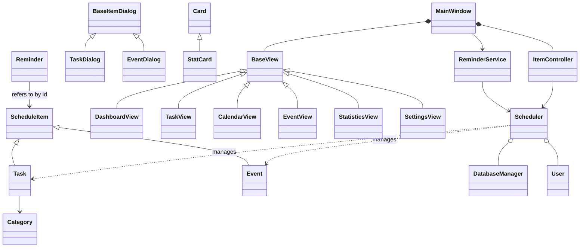

# Personal Scheduler

A desktop scheduler built with **Python 3, PySide6 (Qt 6) and SQLite**, designed to demonstrate
**Object-Oriented Programming**. Everything runs locally on Windows: no server, no browser.
Data is stored in one file: `data/scheduler.db` (created automatically on first run).


## Features
Dashboard (date, live clock, counters, today's tasks, upcoming events, tasks due soon) ·
Add / edit / delete tasks (with confirmation) · Status: Pending / In Progress / Completed ·
Calendar with highlighted days · Search by title/description · Filters (date, category, priority, status) ·
Priorities Low/Medium/High · Reminders (pop-up when the time arrives) · Recurring tasks (daily/weekly/monthly) ·
Events with location and overlap warning · Statistics · Light/Dark theme · Profile settings.

## Time format and notifications
- Times are shown in **12-hour format** (9:30 PM). They are still stored as 24-hour text in the
  database, so existing data keeps working. When typing a time, `9:30 PM` and `21:30` are both accepted.
- Reminders are sent as **Windows desktop notifications**. Closing the window hides the app to the
  system tray so reminders keep arriving; right-click the tray icon and choose **Quit** to exit.
  Settings has a **Send test notification** button.

## Installation (Windows)
1. Install **Python 3.10 or newer** from python.org (tick *"Add Python to PATH"*).
2. Open a terminal in the `personal_scheduler` folder and run:
   ```
   python -m venv venv
   venv\Scripts\activate
   pip install -r requirements.txt
   ```
   The only required package is **PySide6**. SQLite (`sqlite3`) and `datetime` come with Python.
3. Start the app:
   ```
   python main.py
   ```
Keep the folder somewhere writable (Documents, Desktop), not inside `Program Files`.

## Run the tests
```
python -m unittest discover -s tests -t .
```
21 tests cover the models, validators, database, scheduler rules (recurrence, statistics, conflicts),
reminders, and a headless build of the whole GUI.

## Project structure
```
personal_scheduler/
├── main.py                  Application class: creates and connects all objects
├── requirements.txt
├── database/
│   └── database_manager.py  DatabaseManager - the ONLY place with SQL
├── models/
│   ├── schedule_item.py     ScheduleItem (abstract base class)
│   ├── task.py              Task(ScheduleItem)
│   ├── event.py             Event(ScheduleItem)
│   ├── reminder.py          Reminder
│   ├── category.py          Category
│   └── user.py              User
├── services/
│   ├── scheduler.py         Scheduler - business logic (facade for the GUI)
│   └── reminder_service.py  ReminderService + Notification
├── gui/
│   ├── main_window.py       MainWindow: sidebar + screens + reminder timer
│   ├── base_view.py         BaseView: parent of all screens
│   ├── dashboard.py, task_view.py, calendar_view.py,
│   │   event_view.py, statistics_view.py, settings_view.py
│   ├── item_dialog.py       BaseItemDialog (shared form)
│   ├── task_dialog.py, event_dialog.py
│   ├── item_controller.py   ItemController: dialogs -> Scheduler
│   ├── widgets.py           Card, StatCard, helper functions
│   └── styles.py            Light/Dark style sheets
├── utils/
│   ├── constants.py         Priorities, statuses, colors, reminder options
│   └── validators.py        Validator
├── tests/                   Unit tests + GUI smoke test
├── docs/screenshots/
└── data/                    scheduler.db is created here
```

## Architecture
```
GUI (views, dialogs)  ->  ItemController  ->  Scheduler  ->  DatabaseManager  ->  SQLite
                                                  ^
                                         ReminderService (no GUI code)
Models (Task, Event, ...) are plain objects passed between the layers.
```
Rule: **GUI classes never contain SQL**, and **models never import Qt**.

### Class diagram


## Database
Tables `users`, `categories`, `tasks`, `events`, `reminders`. Dates are stored as ISO text
(`2026-10-02`, `14:30`) and converted to Python `date`/`time` objects by `DatabaseManager`.
All queries use `?` placeholders (parameterized), so user input can never change the SQL.
Default categories (Study, Work, Personal, Exercise, Other) and a default user are inserted on first run.

## Where each OOP concept is used

**Encapsulation**
- Models keep data in private attributes (`_title`, `_priority`, ...) and expose it through properties.
  Setters validate: `task.priority = "Urgent"` raises `ValueError`, so a Task can never hold invalid data.
- `DatabaseManager._conn` is private; nobody else can touch the connection.
- `Scheduler._db`, `Scheduler._user`, `Reminder._triggered` are hidden behind methods.

**Abstraction**
- `ScheduleItem` is an abstract class (`ABC`): it cannot be instantiated and forces subclasses to
  implement `get_type()` and `get_summary()`.
- `DatabaseManager` hides SQL behind methods like `get_tasks(priority="High")`; it also converts
  `sqlite3` errors into its own `DatabaseError`.
- `Scheduler` hides everything below it; the GUI only knows `Scheduler`.
- `BaseView.build_ui()` / `refresh()` define what every screen must provide.

**Inheritance**
- `Task` and `Event` extend `ScheduleItem` (shared id, title, date, times, overlap logic).
- All six screens extend `BaseView`.
- `TaskDialog` and `EventDialog` extend `BaseItemDialog` (shared form fields).
- `StatCard` extends `Card`.

**Polymorphism**
- `get_summary()` and `get_type()` behave differently in `Task` and `Event`.
  `Scheduler.items_on(day)` returns a mixed list of `ScheduleItem`s and the Calendar screen calls
  `item.get_summary()` on each without checking the class.
- `MainWindow` stores all screens as `BaseView` and calls `view.refresh()` on each one.
- `build_item()` builds a `Task` in `TaskDialog` and an `Event` in `EventDialog`.

**Composition / aggregation**
- `Scheduler` has a `DatabaseManager` and a `User`, and manages `Task`/`Event` objects.
- `MainWindow` owns the screens, the `ItemController` and the `ReminderService`.
- `Application` (in `main.py`) builds the whole chain by passing objects through constructors.

**Constructors** - every class initializes its state in `__init__`; subclasses call `super().__init__()`.
**Separation of responsibilities** - models = data, database = SQL, services = rules, gui = display,
controller = dialog workflow, validators = input rules.
**Class methods / static methods** - `Validator` rules, `DatabaseManager._text_to_date`, `Scheduler._next_date`.

## Possible future improvements
Edit/add categories in the UI · system-tray notifications · drag-and-drop in the calendar ·
export/import (CSV, iCalendar) · multiple users with login · task sub-tasks and tags ·
snooze for reminders · weekly view · backup/restore of the database · packaging as `.exe` with PyInstaller.

## Short presentation script (3-4 minutes)
1. **Goal.** "Personal Scheduler is a desktop app to organize tasks, events and reminders. I built it to
   show how OOP makes a program easy to extend and maintain."
2. **Layers.** "The program has four layers: models, database, services and GUI. The GUI never talks to
   SQL; it only talks to the Scheduler class."
3. **Abstraction and inheritance.** "`ScheduleItem` is an abstract class. `Task` and `Event` inherit
   from it, so shared code like title validation and overlap detection is written once."
4. **Polymorphism.** "In the calendar I get a list of mixed items. I call `get_summary()` on each one
   and every class answers in its own way. The same idea works for screens: every screen is a `BaseView`
   with `refresh()`."
5. **Encapsulation.** "Attributes are private and use properties. If I try to set an invalid priority,
   the setter raises an error, so objects always stay valid."
6. **Composition.** "`Scheduler` contains a `DatabaseManager`; `MainWindow` contains the views.
   Objects are connected in `main.py` through constructors, with no global variables."
7. **Live demo.** Add a task with a reminder 1 minute ahead -> mark it Completed -> show the calendar and
   statistics -> switch to the dark theme. Mention the 21 unit tests.
8. **Closing.** "Because of this structure, adding a new item type, like a Note class, only needs a new
   subclass and one new table."

## Troubleshooting
- *`python` is not recognized*: reinstall Python with "Add Python to PATH", or use `py main.py`.
- *`ModuleNotFoundError: PySide6`*: activate the virtual environment and run `pip install -r requirements.txt`.
- *Reset all data*: close the app and delete `data/scheduler.db`.
